# IBM Bob: AI-Powered SDLC Lab
## DevSparks Hyderabad 2026

---

## Contents
- [About this Lab](#about-this-lab)
- [Overview](#overview)
- [Pre-requisites](#pre-requisites)
- [How this lab is structured — the MCP + Mode + Skill system](#how-this-lab-is-structured--the-mcp--mode--skill-system)
- [Hands-on Lab Steps](#hands-on-lab-steps)
  - [Step 1 — Open the Repo in Bob and Configure MCP Servers](#step-1--open-the-repo-in-bob-and-configure-mcp-servers)
  - [Step 2 — Fetch Open Issues with GitHub CLI](#step-2--fetch-open-issues-with-github-cli)
  - [Step 3 — Plan Mode: Research, Design Diagram, and Approval](#step-3--plan-mode-research-design-diagram-and-approval)
  - [Step 4 — Agent Mode: Implement the Feature](#step-4--agent-mode-implement-the-feature)
  - [Step 5 — Generate Architecture Diagram for Documentation](#step-5--generate-architecture-diagram-for-documentation)
- [What You Just Built](#what-you-just-built)
- [Troubleshooting](#troubleshooting)

---

## About this Lab

This lab shows you how to use IBM Bob as an **end-to-end AI pair programmer across the entire Software Development Life Cycle (SDLC)** — from reading GitHub issues all the way through to a documentation-ready architecture diagram.

You will connect Bob to three external tools and see them work together in a single conversation:

- **GitHub CLI (`gh`)** — Bob calls `gh` commands to list and read issues directly from your GitHub repo. No context-switching to a browser
- **Tavily** — Bob uses Tavily's web search and research tools inside Plan mode to look up best practices, read documentation, and ground its design decisions in real-world sources
- **Draw.io MCP** — Bob calls the Draw.io MCP server to produce a proper design diagram that you can open, edit, and embed in documentation

These three are wired together through Bob's **MCP (Model Context Protocol)** configuration. You will learn how to register each one, what they do, and how to use them together in a structured SDLC workflow.

The SDLC flow this lab follows:

```
Issues → Pick one → Plan (research + diagram) → Approve → Build → Arch diagram
```

Everything happens through prompts. You drive; Bob does the work.

---

## Overview

| SDLC Phase | What Bob Does | Tool Used |
|---|---|---|
| **Discovery** | Fetches open GitHub issues | `gh` CLI via `execute_command` |
| **Planning** | Researches the topic with live web search | Tavily MCP (`tavily_research`, `tavily_search`) |
| **Design** | Generates a visual design diagram | Draw.io MCP |
| **Development** | Implements the feature using subagents and subtasks | Agent Mode + subtasks/subagents |
| **Documentation** | Produces a final architecture diagram | Draw.io MCP |

### Bob Concepts You Will Use

| Concept | What it is | Where |
|---|---|---|
| **MCP Servers** | External tools Bob can call as native functions | `.bob/mcp.json` |
| **Agent Mode** | Bob's default implementation mode — reads, writes, runs commands | Built-in |
| **Plan Mode** | A Bob mode focused on structured thinking before coding; Bob switches to it automatically when asked to plan | Built-in |
| **Ask Mode** | Bob's read-only mode for exploration and questions | Built-in |

---

## Pre-requisites

### IBM Bob IDE
Install IBM Bob from: `https://bob.ibm.com/docs/ide/getting-started/install`

> **Make sure you are logged in to Bob IDE before starting the lab.**

### GitHub CLI (`gh`)

Bob will issue `gh` commands to fetch issues from your repo. You need `gh` installed and authenticated.

Download and install the GitHub CLI from the official site:

```
https://cli.github.com/
```

After installing, authenticate:
```sh
gh auth login
```

Follow the prompts — choose **GitHub.com** → **HTTPS** → authenticate with your browser. When `gh auth status` returns your username, you are ready.

### Tavily API Key

Tavily powers web search and research inside Plan mode.

1. Go to [https://www.tavily.com/](https://www.tavily.com/) and sign up for a free account
2. Copy your **API Key** from the dashboard

You will paste this key into the MCP configuration in Step 1.

### Draw.io MCP Server

Install the Draw.io MCP server globally via npm:

```sh
npm install -g @drawio/mcp
```

Verify the install: `drawio-mcp --version`

### The Lab Repository

This lab uses the same repo you already have open from Lab 1. If you are starting fresh:

1. Go to `https://github.com/anuj34822/DevSparks-Hyderabad-2026`
2. Clone the repo in your local, and open the folder in Bob IDE

---

## Hands-on Lab Steps

> **Before you begin:** Make sure you are logged in to IBM Bob IDE. Open Bob and confirm your account is active — you should see your name or profile icon at the bottom-left of the IDE.

> **Note:** Almost everything in this lab is done through prompts. You type a sentence in Bob — Bob does the work. The only exception is registering the MCP servers in Step 1, which is a one-time JSON edit.

---

### Step 1 — Open the Repo in Bob and Configure MCP Servers

**Goal:** Register the Tavily and Draw.io MCP servers so Bob can use them as native tools.

#### 1a — Open the project in Bob

If not already open from Lab 1, open the `DevSparks-Hyderabad-2026` folder in Bob IDE.

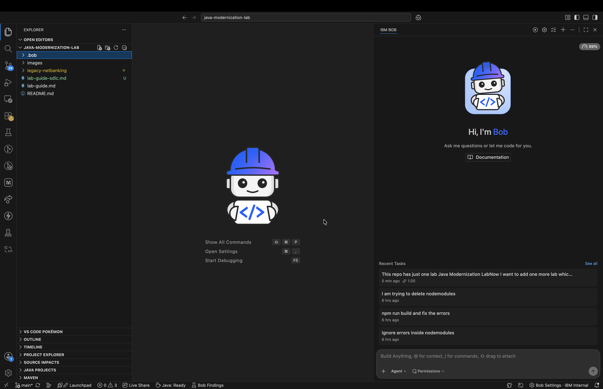

#### 1b — Open Bob MCP Settings

1. Open **Bob Settings** (gear icon at the bottom-left of the IDE)
2. Click **MCP** in the left sidebar
3. Click the **+** icon to add a new server
4. Select **Global** from the scope dropdown
5. Click **Open Configuration File**

This opens the global `mcp.json` file in the editor.

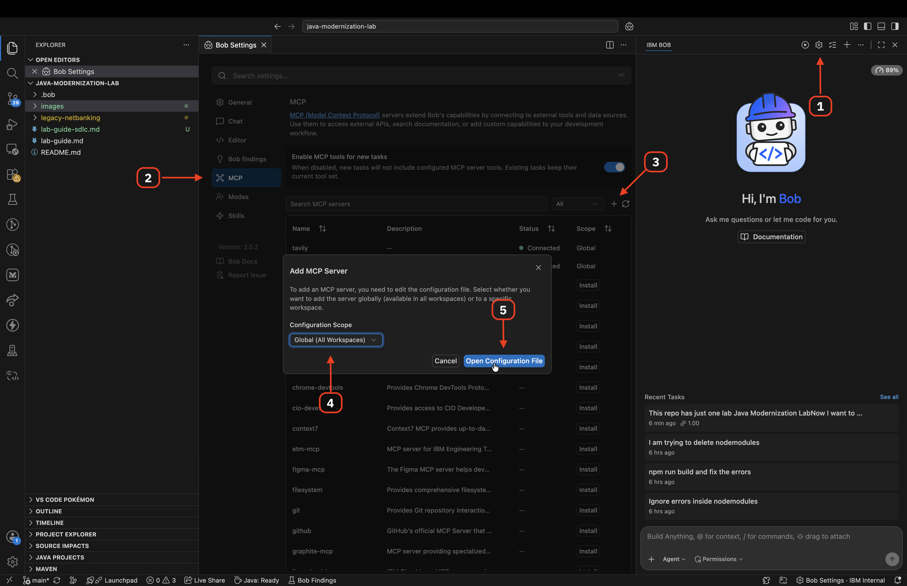

#### 1c — Paste the MCP configuration

Copy the JSON block below (your instructor will provide the exact content with all keys filled in), paste it into `mcp.json`, and save the file.

> **Replace `YOUR_TAVILY_API_KEY`** with the API key you copied from the Tavily dashboard.

```json
{
  "mcpServers": {
    "tavily": {
      "url": "https://mcp.tavily.com/mcp/?tavilyApiKey=<your-api-key>"
    },
    "drawio": {
      "command": "npx",
      "args": ["@drawio/mcp"]
    }
  }
}
```

#### 1d — Verify MCP servers are active

1. Click the **MCP** status icon in the Bob IDE status bar (bottom right)
2. You should see both `tavily` and `drawio` listed with a green connected indicator

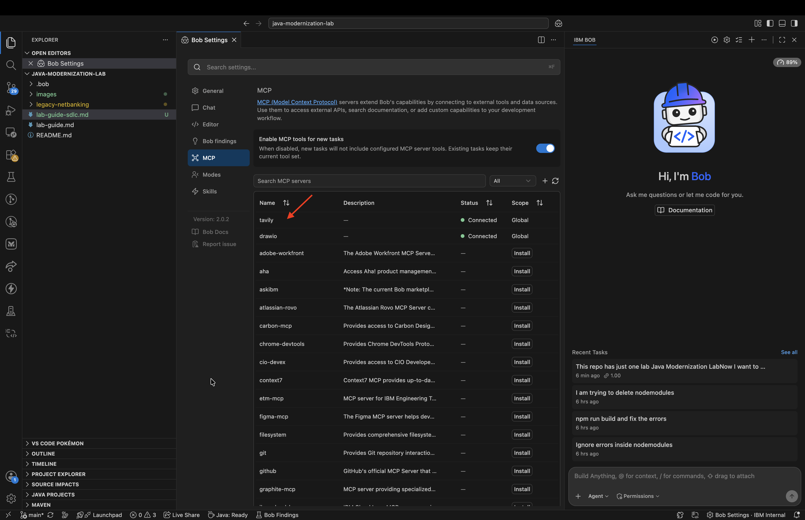

> **Tip:** If a server shows as disconnected, hover over it for the error. The most common cause is a missing API key or `node` not on the PATH. See [Troubleshooting](#troubleshooting).

---

### Step 2 — Fetch Open Issues with GitHub CLI

**Goal:** Ask Bob to list all open GitHub issues for the repo — without leaving Bob.

#### 2a — Start in Agent Mode

Bob IDE opens in **Agent** mode by default. Confirm the mode selector at the bottom-right shows **Agent** — if not, click it and select **Agent**.

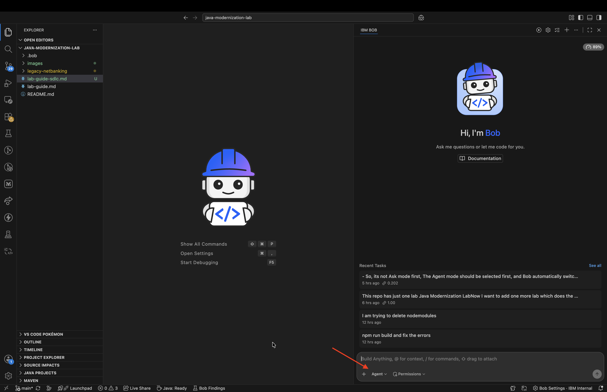

> **Agent mode is your starting point throughout this lab.** Bob automatically switches to Plan mode when you ask it to plan, and switches back to Agent when it is time to build. You do not need to manually switch modes except to start in Agent.

#### 2b — Ask Bob to fetch the issues

Type the following prompt and press **Enter**:

> *"Check if there are any open issues in this GitHub repo and list them for me. Make use of gh cli"*

Bob runs a `gh issue list` command against the current repo, then formats the results as a numbered list with title, issue number, and label.

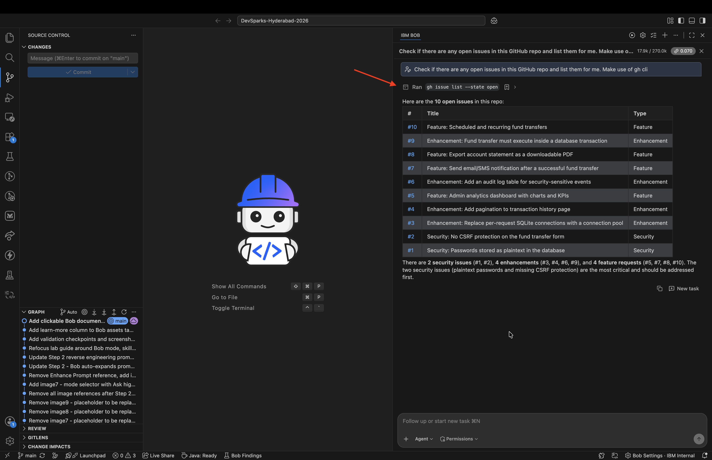

#### 2c — Pick an issue to work on

Review the list Bob returns. For this lab, we will work on the first open issue in the list.

Tell Bob which issue you want to work on:

> *"Let's work on issue #3. Can you fetch the full details of that issue?"*

Bob runs `gh issue view 3` and returns the full issue body, including acceptance criteria and any labels.

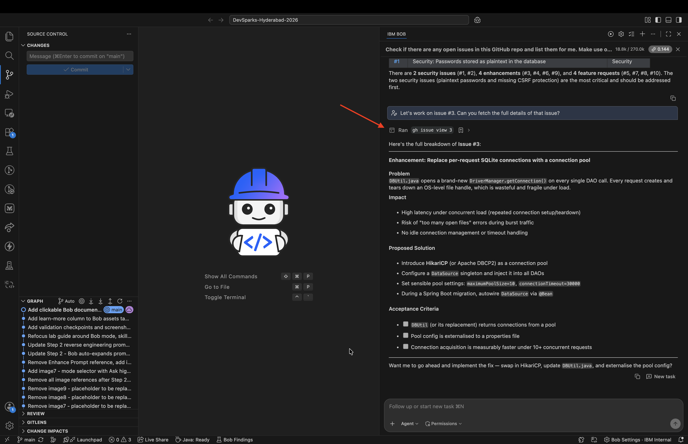

---

### Step 3 — Plan Mode: Research, Design Diagram, and Approval

**Goal:** Let Bob research the feature, produce a design document with a Draw.io diagram, and wait for your approval before a single line of code is written.

> **This is where Plan mode and the `create-plan` skill come in.** When you switch to Plan mode, Bob automatically activates the `create-plan` skill. This skill tells Bob to: break the work into subtasks, ask clarifying questions before committing to a design, use Tavily to back decisions with real sources, and produce a diagram before proceeding. Bob will not write code — it will only plan and wait.

#### 3a — Switch to Plan Mode

Bob switches to Plan mode automatically when you ask it to plan.

Type this prompt and press **Enter**:

> *"I want to work on issue #3. Get the latest best practices from internet, create a design plan, and generate a Draw.io architecture diagram. Do not write any code yet — I need to approve the plan first."*

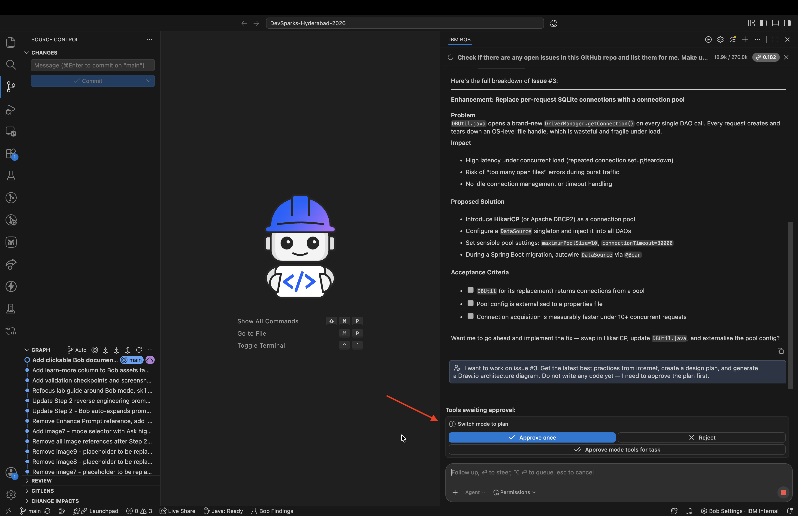

Watch what happens next. Bob will:

1. **Auto load the create-plan skill** - Uses this skill to efficiently plan the task and make the best use of subagents and subtasks to not overload the context window of your main task

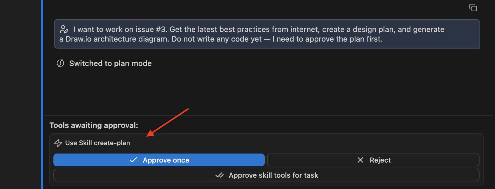

2. **Spawns subagents to understand your codebase** — Bob will start exploring your codebase by spawing subagents.

3. **Run web research using Tavily** — Bob calls `tavily_research` to look up latest best practices available on the internet/web.

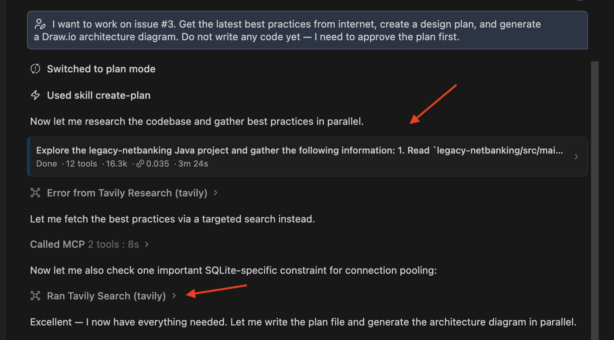

5. **Produce a written design plan** — Bob writes a structured plan covering: API endpoint design, service layer, security considerations, and library choices, with source links from Tavily

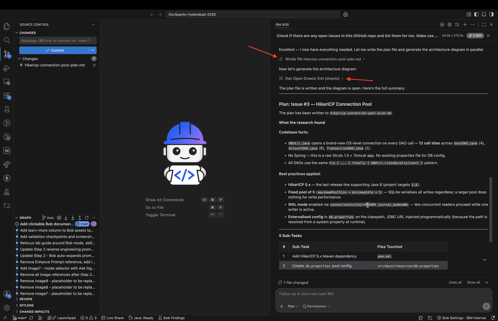

6. **Generate a Draw.io design diagram** — Bob calls the Draw.io MCP server to create a design diagram file in the workspace

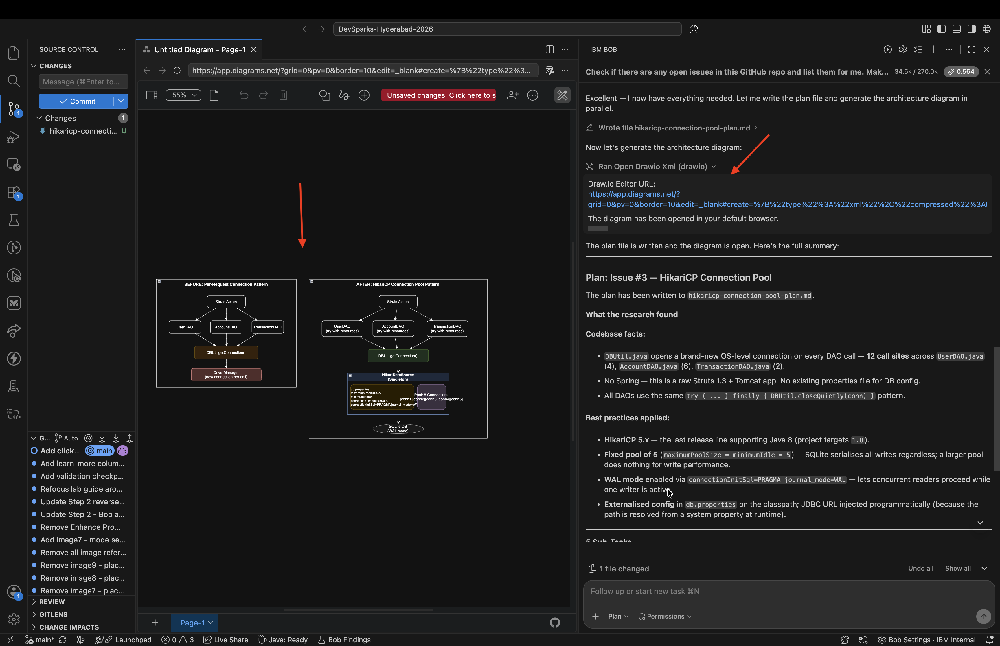

#### 3d — Approve the plan

If the plan and diagram look correct, type:

> *"The plan looks good. I approve. Proceed to implementation."*

If you want changes — for example, *"Can you add an async queue for large exports?"* — tell Bob and it will revise the plan and update the diagram before asking for approval again.

> Bob will not write a single line of application code until you have explicitly approved the plan. This is enforced by the `create-plan` skill.

---

### Step 4 — Agent Mode: Implement the Feature

**Goal:** Let Bob implement the approved plan using subagents and subtasks.

> **This is where Agent mode comes in.** Once you approve, Bob switches to Agent mode and uses the `start_subtask` and `spawn_subagent` tools to divide the work into parallel workstreams — backend API, service layer, frontend integration — and complete them systematically with a live todo list.

#### 4a — Switch to Agent Mode

After approving the plan, Bob automatically switches back to **Agent** mode. You can confirm this in the mode selector at the bottom-right of the IDE.

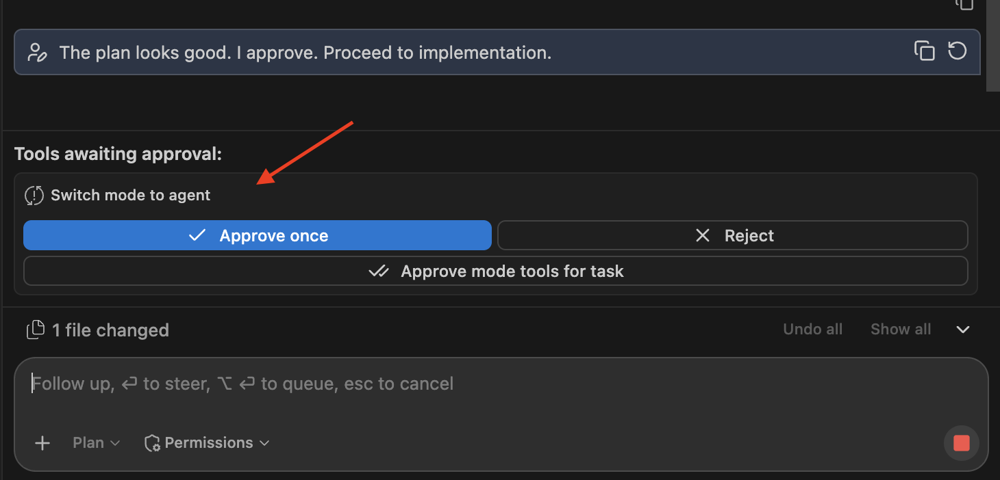

#### 4b — Tell Bob to start

Bob produces a todo list and begins working:

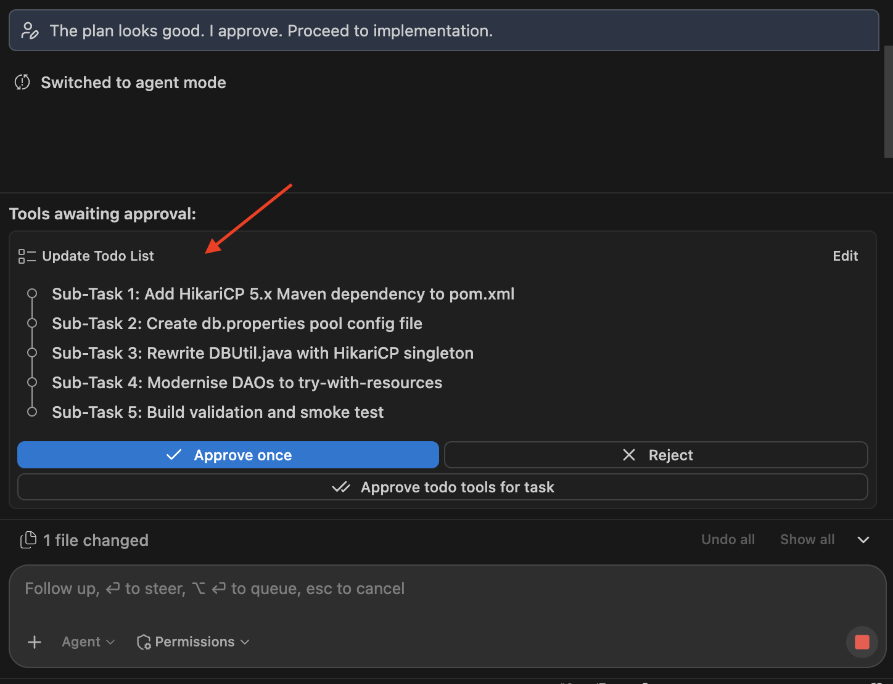

#### 4c — Monitor progress and continue if Bob pauses

If Bob stops before finishing, type:

> *"Complete remaining tasks from the todo list."*

When all tasks are done, Bob reports completion and lists every file it created or modified.

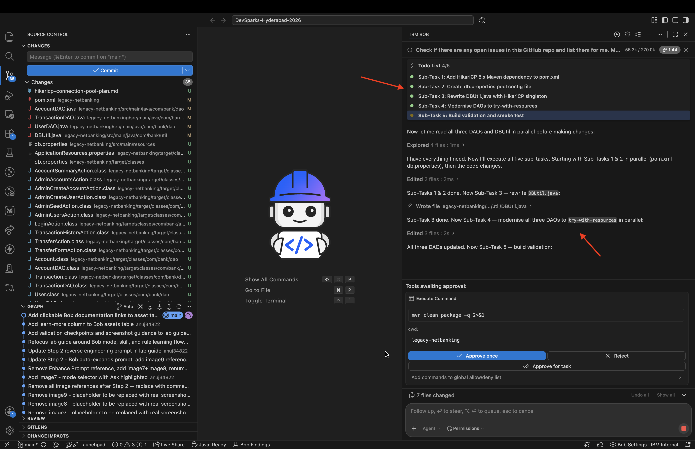

---

### Step 5 — Generate Architecture Diagram for Documentation

**Goal:** Ask Bob to produce a final, polished architecture diagram using Draw.io that you can embed in a README, Confluence page, or design document.

#### 5a — Ask Bob to generate the arch diagram

Still in **Agent** mode, type:

> *"Generate a final architecture diagram of the feature we just built. Make it suitable for documentation — include component names, data flow arrows, and technology labels. Use Draw.io."*

Bob calls the Draw.io MCP server to create an architecture diagram — a clean, annotated diagram covering the full stack from the React UI through to the output.

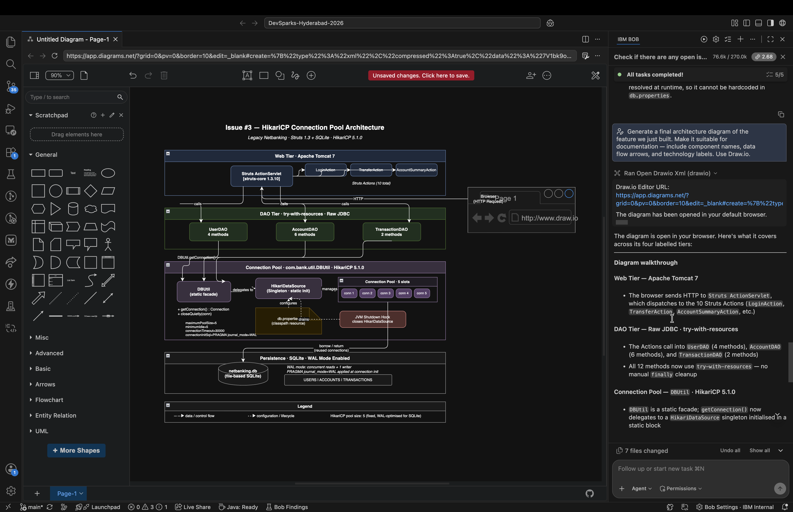

You now have a documentation-ready architecture diagram that perfectly reflects what was built — generated from the same source as the implementation, in the same tool session.

---

## What You Just Built

| Phase | What happened | Tools used |
|---|---|---|
| **Discovery** | Bob fetched all open GitHub issues without leaving the IDE | `gh` CLI → `execute_command` |
| **Issue detail** | Bob read the full issue body including acceptance criteria | `gh issue view` → `execute_command` |
| **Research** | Bob looked up best practices, library docs, and security patterns from the live web | Tavily `tavily_research` + `tavily_search` MCP |
| **Design** | Bob produced a structured plan with citations and a visual design diagram | Plan Mode + `create-plan` skill + Draw.io MCP |
| **Approval gate** | Code only started after you explicitly approved | `create-plan` skill enforcement |
| **Implementation** | Bob built the full feature across backend + frontend using parallel subagents | Agent Mode + `start_subtask` + `spawn_subagent` |
| **Documentation** | Bob generated a polished architecture diagram ready to embed in docs | Draw.io MCP |

### The system you configured

```
.bob/
└── mcp.json          ← registered Tavily + Draw.io MCP servers (you added this)
```

Plus two built-in Bob capabilities you activated through mode selection:

- **Plan Mode** → activates the `create-plan` skill → structured SDLC planning with approval gates
- **Agent Mode** → subagents and subtasks → parallel, tracked implementation

This configuration travels with the repo. Any developer who clones it and opens it in Bob gets the same MCP servers, the same workflow, and the same guardrails — automatically.

---

## Troubleshooting

### `gh: command not found`
Download and install the GitHub CLI from [https://cli.github.com/](https://cli.github.com/), then run `gh auth login`.

### Tavily MCP shows as disconnected
- Check that your API key is correctly set in `mcp.json` (no spaces, no missing quotes)
- Try pasting your key again from the Tavily dashboard at [https://www.tavily.com/](https://www.tavily.com/)

### Draw.io MCP shows as disconnected
- Verify the package is installed: `npm list -g @drawio/mcp`
- Re-run the install: `npm install -g @drawio/mcp`

### Draw.io file opens as XML text instead of diagram
Install the **Draw.io Integration** extension in Bob IDE (Extensions → search "Draw.io Integration" by Henning Dieterichs).

### Bob stops mid-implementation
Type: *"Complete remaining tasks from the todo list."*

### Bob writes code without plan approval
Make sure you switched to **Plan** mode before the planning prompt in Step 3. The `create-plan` skill only activates in Plan mode.

### `gh issue list` returns empty even though issues exist
Verify the repo remote is set: `git remote -v`. If it shows SSH, make sure your SSH key is added to GitHub and `gh auth status` shows an active session.
